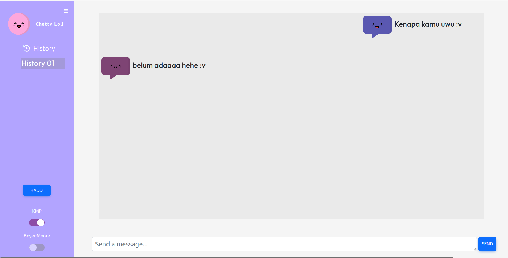

# Tubes_3_IF2211

Chat-GPT "Chatty Loli"

<p align="center">
  
</p>

## Prereq

- Front-end : NodeJS v18.15.0 dan NPM v9.6.4 
- Back-end : Go Version 1.2.3

This task is done to fulfill Strategy and Algorythm IF2211

# Table of Contents
* [Description](#markdown-header-description)
* [Dependencies](#markdown-header-dependencies)
* [How to Run](#markdown-header-how-to-run)
* [Folder Structure](#markdown-header-folder-structure)
* [Author](#markdown-header-author)

# Description
This is a chatbot web based application that process and answer chat automatically. This chatbot can handle message such like math operation, date (tell the bot calculate the day), adding question to database or updating the answer if the question is already in database, erasing question, and answering random question being input by the user.

# Dependencies
Make sure you have this
```
1. Visual Studio
2. .NET SDK `ver 6.0.0` or above
```

# How To Run
Click this link to run our Chatty Loli bot!
[Chatty Loli](https://tubes3-if-2211-yx64.vercel.app/) 


# Folder Structure
```bash                             
├── doc
    └── Laporan.pdf
├── src
    ├── backend
          └── algorithm
                ├── bm.go
                ├── date.go
                ├── kmp.go
                ├── levenshtein.go
                ├── mathop.go
                └── regex.go
          └── controller
                └── inputController
                      └── inputController.go
                └── qnaController
                      └── qnaController.go
                └── sessionController
                      └── sessionController.go
          └── db
                ├── chatty_loli.sql
                └── connect.go
          └── model
                └── models.go
          ├── .env
          ├── go.mod
          ├── go.sum
          └── main.go
    └── frontend
          ├── public
          └── src
          ├── package-lock.json
          ├── package.json
          └── README.md

└── README.md
```


## Author
| NO | NAMA | NIM |
--- | --- | --- |
| 1 | Jeremya Dharmawan Raharjo | 13521131 |
| 2 | Brigita Tri Carolina | 13521156 |
| 3 | Kandida Edgina Gunawan | 13521155 |
